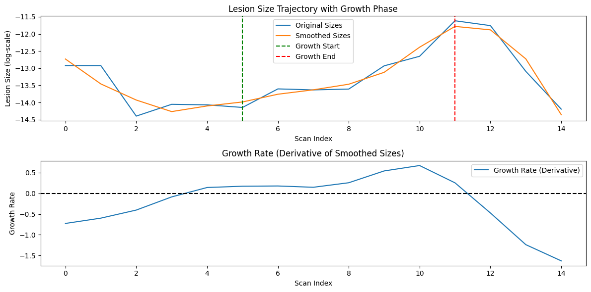

## Files

```sh
├── inr.ipynb # basically tests out an algorythm to find the indices of where the bigges starting and ending sequence of a trajectory is to only train on growing trajectories
```

## Results

