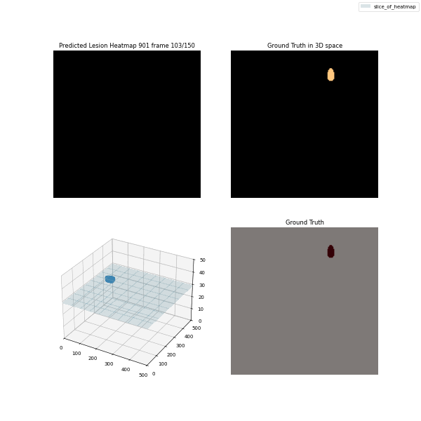

## Idea

We want to train on a new patient that is not yet in the dataset by just finding the right embedding

## Results

It worked pretty well:

The run_id is 4014cad89e404416bdbe4bbfcefe505e and it can be found under the link
http://127.0.0.1:5000/#/experiments/1/runs/4014cad89e404416bdbe4bbfcefe505e